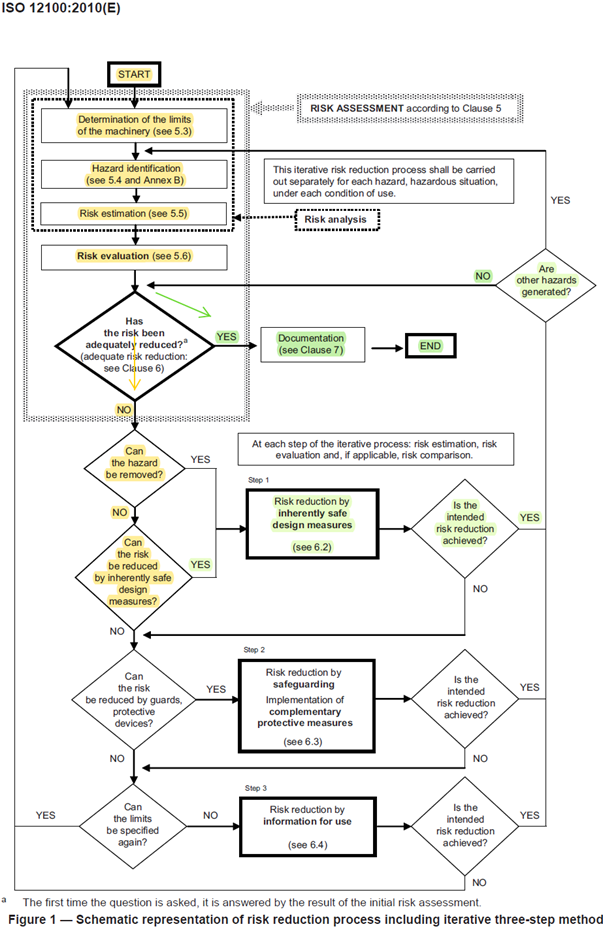

Risk reduction in cranes by using the MotoSuiveur® Solution
===========================================================

EN ISO 12100:2010: Safety of machinery — General principles 
for design — Risk assessment and risk reduction

.. _Risk reduction process according to ISO 12100-2010: 

	Risk reduction process according to ISO 12100-2010

1) We assume that the risk analysis is already internally done by Arcelor. 
We guess that the identified risk is: “A load drop can lead to severe injuries 
or damage to health or death”.

2) We assume that this risk is currently not adequately reduced and needs to be 
further reduced to an acceptable level. 

3) According to Clause 6.1, the mandatory Step 1 is risk reduction by inherently 
safe design measures*. They must be applied as close as possible to the load, i.e., 
at the rope drum.

The MotoSuiveur Unit (MS) is an inherently safe design measure against load drop. 
It applies the principle of positive mechanical action (Clause 6.2.5) directly 
to the drum. Moreover, the MS achieves its protective measure without relying on 
any control system (Clause 6.2.11 not used, hence ISO 13849-1 and ISO 62061 not 
applicable). 

A MotoSuiveur unit can be attached to the drum flange, thus making the whole 
hoist much safer.

In addition to directly addressing the risk, the MotoSuiveur unit has its own 
independent means to cut off the electrical power, thus protecting the whole 
machine from further damage.

4) This upgrade does not generate other hazards.

5) By implementing a MotoSuiveur unit attached to the drum flange, the risk is 
dramatically reduced. Further risk reduction may not be necessary **.

(We assume that the measures called by Clause 6.1 steps 2 and 3 are already in place).

6) SIGUREN can assist Arcelor with the documentation that shall demonstrate the 
results and how the risk reduction has been achieved.

* According to Clause 3.20 an inherently safe design measure is a protective 
measure which either eliminates hazards or reduces the risks associated with 
hazards by changing the design or operating characteristics of the machine 
without the use of guards or protective devices.

-	The MS eliminates the risk of load drop in case of hoist failures (both 
mechanical and control)
-	The MS eliminates the risk of load overspeed and uncontrolled movement

Indeed, when an MS Unit is attached to the drum, it becomes physically impossible 
to freewheel it or to run it at high speed. The MS Unit will inescapably and safely 
arrest the drum.

** An overload can also lead to a load drop, or even to the collapse of the whole 
crane. The Torque Limiter, specially designed as a part of the “MotoSuiveur 
Solution” is an inherently safe design measure against overload and can be 
easily implemented at the gearbox input.
