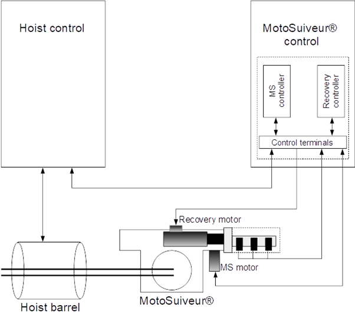

MotoSuiveur Manual (from Ternium project)

Introduction
--------------

Object of this manual is to present operation modes of MotoSuiveur® (further called MS). Manual describes electrical part of MS, MS operation modes, troubleshooting and maintenance. On figure 1 is presented MS main block diagram.

